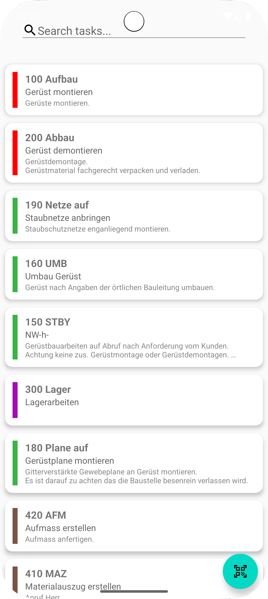
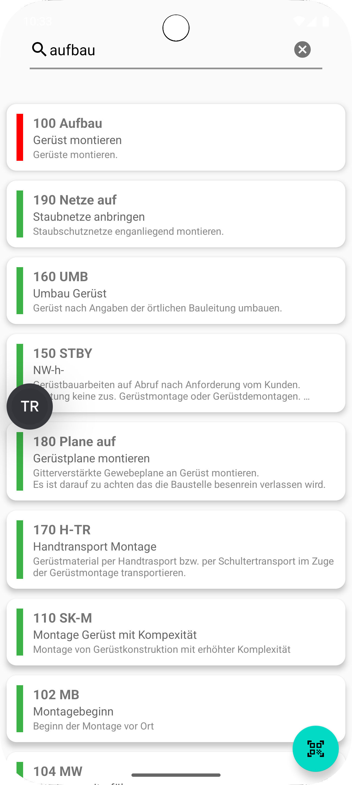
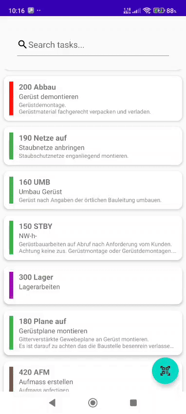
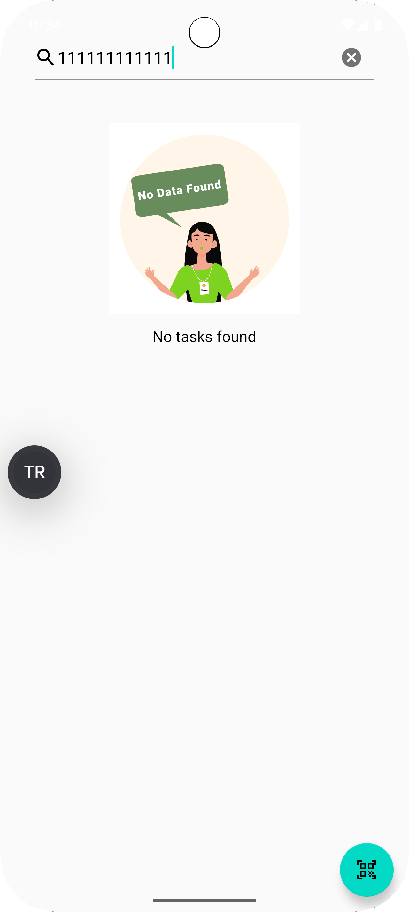

# TaskBuddy 🧱

**TaskBuddy** is a demo Android application developed as part of a coding assignment.  
It connects to a remote API, fetches task data, supports offline usage, provides filtering
capabilities, and integrates QR code scanning.

---

## 📌 Features

- **Authentication**: Logs in using Basic Auth and uses Bearer token for subsequent requests.
- **Remote + Offline Sync**: Fetches tasks from the [BauBuddy API](https://api.baubuddy.de) and
  caches them locally using Room DB.
- **Task List View**: Displays tasks including `task`, `title`, `description`, and a colored view
  based on `colorCode`.
- **Search Functionality**: Search bar in the toolbar that can filter by **any** property of the
  data model.
- **QR Code Scanning**: Allows scanning QR codes and uses the scanned content to populate the search
  query.
- **Data Refresh**:
    - Pull-to-refresh using `SwipeRefreshLayout`
    - Periodic background sync every 60 minutes using `WorkManager`

---

## ⚙️ Tech Stack

- **Kotlin + MVVM Architecture**
- **Room Database**
- **Retrofit**
- **OkHttp + Interceptors**
- **WorkManager**
- **Hilt (DI)**
- **Jetpack Navigation**
- **Coroutines + Flow**
- **ZXing (QR Code Scanner)**
- **SwipeRefreshLayout**
- **Lottie Animations**

---

## 📸 Screenshots

1. Task list sorted by `task`:
   ```
   
   ```

2. Filtered task list after a search:
   ```
   
   ```

3. QR Code scanner:
   ```
   
   ```

4. No results screen:
   ```


```

---

## ▶️ Getting Started

1. Clone the repository.
2. Open the project in **Android Studio**.
3. Sync Gradle and install dependencies.
4. Run the app on an emulator or device.
5. Use the following credentials for login:

- `username`: `365`
- `password`: `1`

---

## 📫 Notes

This app was developed for the purpose of evaluating Android development skills, architecture
practices, and feature implementation under a well-defined task.

---

**Happy Coding!** 👨‍💻✨
